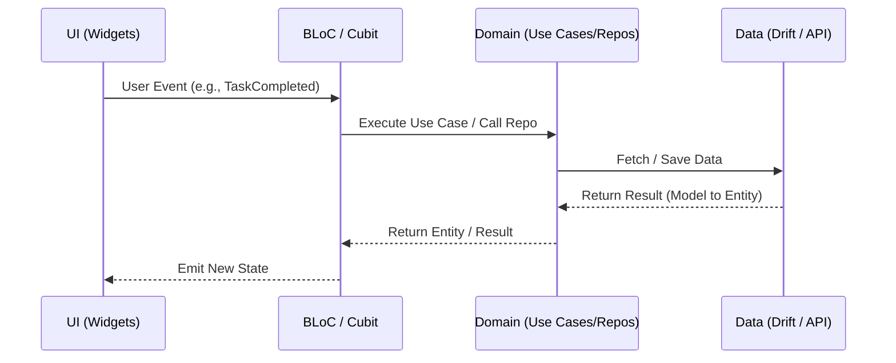

# Reflect — Architecture

**Document version:** 1.0.0

Machine-readable map of the system: versions, boundaries, and where rules live in code. For coding rules see [`AGENTS.md`](AGENTS.md). For feature specs see [`docs/README.md`](docs/README.md).

## Which File Next?

- Need durable coding rules? Read [`AGENTS.md`](AGENTS.md).
- Need the source tree layout? Read [`lib/README.md`](lib/README.md).
- Need feature behavior? Read [`docs/README.md`](docs/README.md).
- Need shipped vs deferred status? Read [`docs/implementation-status.md`](docs/implementation-status.md).
- Need task-to-file lookup? Read [`docs/agent-map.md`](docs/agent-map.md).

---

## 1. Project overview

| Item | Detail |
|------|--------|
| **Product** | Offline-first personal task manager and wellness tool for daily planning, deep reflection, and advanced task recurrence. |
| **Repo shape** | Standalone Flutter app. |
| **Runtime role** | **Offline-First:** All data stored locally in SQLite via Drift. Background sync to Google Calendar is optional. |
| **Environments** | Local (Testing flavor with `.env.testing`), Production (Prod flavor with `.env.production`). |
| **Target Platforms** | Android and iOS. |

### 1.1 Product areas

| Area | Main routes / code | Data source | Spec |
|------|-------------------|-------------|------|
| Tasks | `/today`, `/backlog` | Drift (SQLite) | TBD |
| Planning | `/today/planning` | Drift | TBD |
| Review | `/today/review`, `/reflect` | Drift | TBD |
| Goals | `/goals` | Drift | TBD |
| Settings | `/more/settings` | HydratedBloc | TBD |
| Notifications | N/A (background) | Local Notifications | [`docs/notifications.md`](docs/notifications.md) |

---

## 2. Tech stack and versions

Pin agents to installed versions from `pubspec.yaml`.

| Layer | Package / tool | Version |
|-------|----------------|---------|
| Framework | Flutter SDK | `^3.44.4` |
| Language | Dart | `^3.12.2` |
| UI & Routing | GoRouter | `^17.0.0` |
| State Management | BLoC / Cubit | `^9.1.1` |
| Hydrated State | HydratedBloc | `^11.0.0` |
| Dependency Injection | GetIt | `^9.1.1` |
| Database | Drift | `^2.20.2` |
| Data Modeling | Freezed | `^3.2.3` |
| Networking | Dio | `^5.5.0` |
| Environment Config | flutter_dotenv | `^6.0.0` |
| CI / CD | GitHub Actions | N/A |

---

## 3. Directory structure

```
reflect/
├── docs/                   # Feature specs, testing, agent map
├── lib/
│   ├── core/               # Shared infrastructure (DI, DB, Networking, Router)
│   ├── features/           # Feature modules (tasks, planning, review, etc.)
│   │   └── <feature_name>/
│   │       ├── data/       # Data sources, Repositories (Impl), Models
│   │       ├── domain/     # Entities, Repositories (Interface), Use Cases
│   │       └── presentation/ # BLoC/Cubit, Pages, Widgets
│   ├── l10n/               # Localization files
│   ├── app.dart            # ReflectApp widget, Providers, Router setup
│   └── main.dart           # App entry, binding init, DI setup
├── test/                   # Unit and widget tests mirroring lib/ structure
├── android/                # Android platform code
├── ios/                    # iOS platform code
├── .github/workflows/      # CI (GitHub Actions)
└── Makefile                # Script definitions
```

---

## 4. Architecture and Data Flow

Reflect uses **Feature-Driven Clean Architecture** and strictly follows the dependency rule: Presentation depends on Domain, Data depends on Domain.



---

## 5. TypeScript and tooling

| Setting | Tool | File |
|---------|--------|------|
| Lint | `make lint` (zero analyzer issues required) | [`analysis_options.yaml`](analysis_options.yaml) |
| Format | `make format` | `dart format .` |
| Code Gen | `make gen` | `build_runner` for Freezed, Drift, JSON |
| CI | GitHub Actions | `.github/workflows/` |
